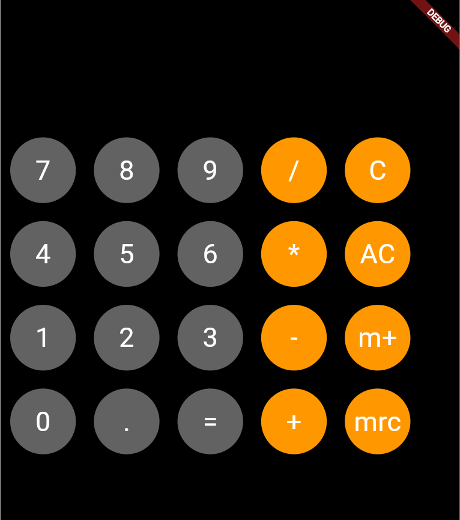
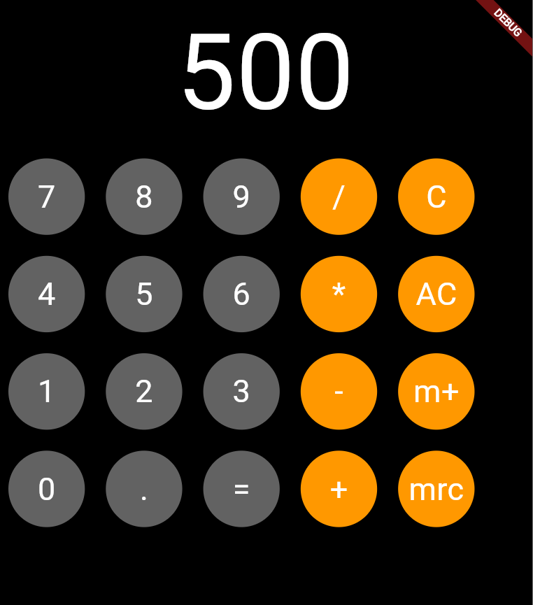

# 📱 Simple Calculator - Flutter  

A basic calculator app built using Flutter. This project provides essential arithmetic operations with a clean UI.  

## ✨ Features  
- Addition, subtraction, multiplication, and division  
- Simple and responsive UI  
- Lightweight and fast performance  
- Memory Plus (m+) functions

## ✅ Prerequisites
Before running this project, ensure you have the following installed:

- Flutter SDK
- Dart (comes with Flutter)
- Android Studio or Visual Studio Code (with Flutter extension)
- A connected device or an emulator (Android/iOS)

## 🛠️ Installation  
1. Clone the repository:  
   ```bash
   git clone https://github.com/Mrghost077/Calculator.git
   ```
2. Navigate to the project directory:  
   ```bash
   cd Calculator
   ```
3. Get dependencies:  
   ```bash
   flutter pub get
   ```
4. Run the app:  
   ```bash
   flutter run
   ```

## 📸 Screenshots    
### 🖥️ Calculator UI  
  

### 📱 Mobile View  
  
 

## 🏗️ Built With  
- Flutter  
- Dart  

## 📌 TODO  
- Improve UI with better styling  
- Add more advanced calculator functions (e.g., square root, percentage)  
- Implement history for past calculations  

## Contributing
Pull requests are welcome. For major changes, please open an issue first to discuss what you would like to change.

## 📜 License  
This project is open-source under the MIT License.  

---  